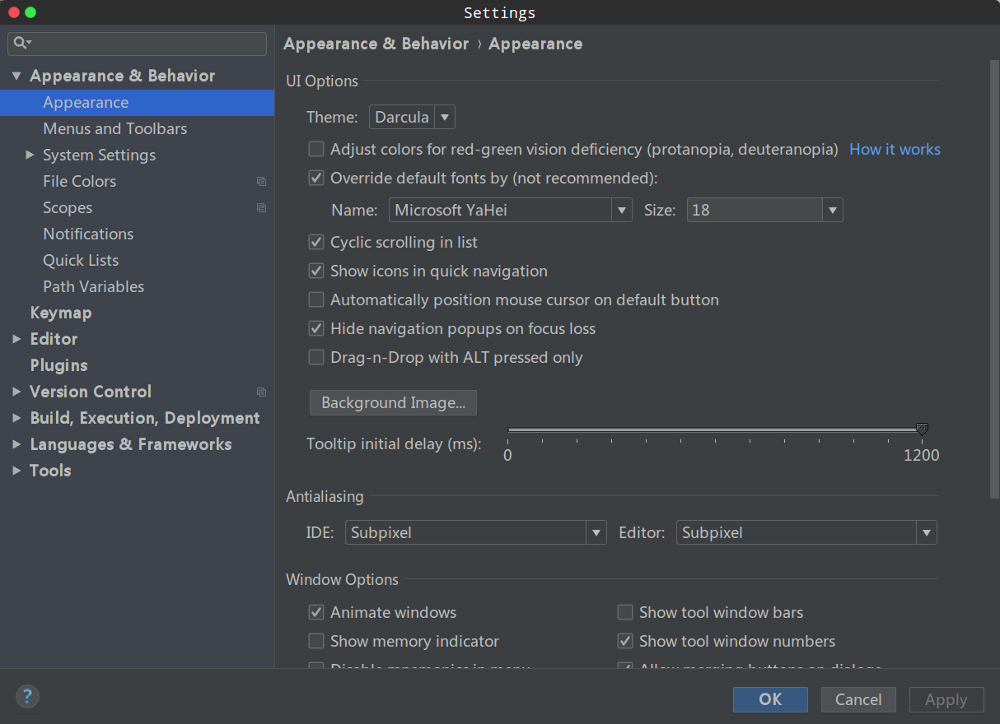
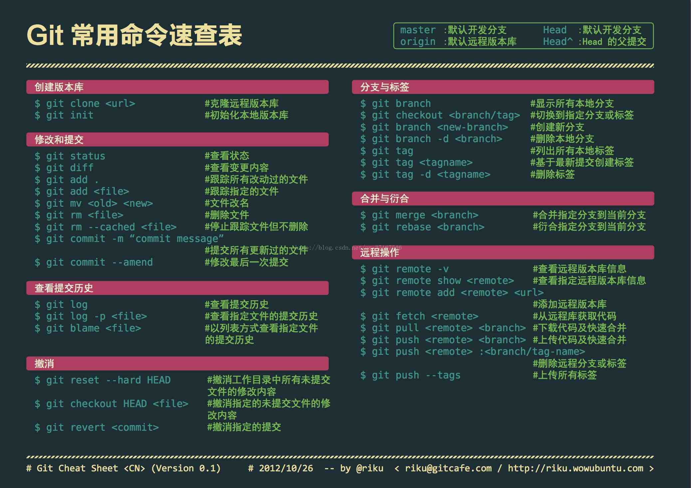

# Linux学习

> 积少成多

---

## 目录

  chapter1  |  chapter2  |   chapter3  |  chapter4
:-:|:-:|:-:|:-:
[愉快使用linux](#happy_linux)|[文件和目录管理](#file)|[进程和任务管理](#task)|[Git](#git)

---

##  愉快使用linux

### 常用简单命令

- 更换成root用户：`su`
- 更换普通用户：`su - <username>`
- 查看当前路径：`pwd`
- 安装软件包：`./*.sh`
- 到处跑：`cd`
- 列出目录下文件及文件夹：`ls`、`ls -a`、`ls -al`
- 新建文件夹：`mkdir <dirname>`
- 删除**空文件夹**：`rmdir <dirname>`
- 删除**非空文件夹**：`rm -r <dirname> `
- 新建文件：`touch <filename>`，`vim <filename>`
- 删除文件：`rm <filename>`
- 文件重命名：`mv <filename1> <filename2>`
- 文件（夹）移动：`mv <path/file(dir)name1>  path/file(dir)name2>`
- 文件（夹）复制：`cp <path/file(dir)name1>  path/file(dir)name2>` 
- 查看环境变量：`echo $PATH` （在不同用户下结果不一样）
- 查看端口占用：`netstat -tunlp | grep <端口号>`

### 截图快捷键

> 参考：[百度经验](https://jingyan.baidu.com/article/bea41d43be1afab4c51be61d.html)

- 整个屏幕截图：`PrintScreen`（在键盘的上方，“F12”右边）
- 活动窗口截图：`Alt + PrintScreen`
- 截取选定区域：`shift+PrintScreen`，鼠标会变成“十”字的形状，点击截取的起点，拖动鼠标设定范围后，截图就被保存了。

### 安装字体

1. 将字体文件复制（移动）到`/usr/share/fonts/`下
   - `cp <path> /usr/share/fonts`
2. 在终端依次执行如下命令：

- `sudo mkfontscale`
- `sudo mkfontdir`
- `sudo fc-cache -fv` 

3. 新的字体安装完成

### Clion修改菜单栏（界面）字体

settings-->appearance-->（勾选）override default fonts(not recommended)-->选择字体

如下图：

### CLion搜索整个项目

快捷键：Ctrl+H

##  文件和目录管理

### 权限

**sudo chmod 777 -R XXX(文件或目录)**
> 参考：[Linux vscode 无法保存　修改文件夹权限](https://www.jianshu.com/p/a72d2244785b)

- sudo chmod 600 ××× （只有所有者有读和写的权限）
- sudo chmod 644 ××× （所有者有读和写的权限，组用户只有读的权限）
- sudo chmod 700 ××× （只有所有者有读和写以及执行的权限）
- sudo chmod 666 ××× （每个人都有读和写的权限）
- sudo chmod 777 ××× （每个人都有读和写以及执行的权限）

ｘｘｘ可以是文件名也可以是单个文件，中间加的　`-R` 是递归这个目录下的所有目录和文件。

### 替换目录下所有文件的字符串

> 参考：[linux替换目录下所有文件中的某字符串](https://www.cnblogs.com/hutudan/p/5778778.html)

比如，要将目录`/modules`下面所有文件中的`zhangsan`都修改成`lisi`，这样做：
> `sed -i "s/zhangsan/lisi/g" `grep zhangsan -rl /modules``

其中：
- `-i` 表示`inplace edit`，就地修改文件
- `-r` 表示搜索子目录
- `-l` 表示输出匹配的文件名

### 文件搜寻

**whereis**
`whereis [-bmsu] 文件或者目录名`
- `-b`：搜寻二进制文件
- `-m`：只找在说明档 manual 路径下的文件
- `-s`：只找 source 来源文件
- `-u`：搜寻不在上述三个项目当中的其他特殊文件

**locate**
`locate [-ir] keyword`
- `-i`：忽略大小写的差异
- `-r`：后面可接正规表示法的显示方式
直接在后面输入『文件的部分名称』后，就能够得到结果，只要是相关的，都会列出来。

**find**
`find [PATH] [option] [action]`
1. 与时间有关的选项
    - `mtime  n` ：n 为数字，意义为在 n 天之前的『一天之内』被更动过内容的文件；
    - `mtime +n` ：列出在 n 天之前(不含 n 天本身)被更动过内容的文件档名；
    - `mtime -n` ：列出在 n 天之内(含 n 天本身)被更动过内容的文件档名。
    - `newer file` ：file 为一个存在的文件，列出比 file 还要新的文件档名

2. 与文件权限及名称相关的参数
    - `name filename`：搜寻文件名称为 filename 的文件；

    - `size [+-]SIZE`：搜寻比 SIZE 还要大(+)或小(-)的文件。这个 SIZE 的规格有：

         c: 代表 byte， k: 代表 1024bytes。所以，要找比 50KB还要大的文件，就是『 -size +50k 』

**whereis 和 find 的区别**
- `whereis`快于`find`
- `whereis`和`locate`从系统的数据库文件里搜寻，`find`直接搜索硬盘
- `whereis`和`locate`有可能搜不到刚刚创建的文件或者搜到已经删除的文件
- `whereis`和`locate`已创建的数据库`/var/lib/mlocate/`中搜索，数据库每天更新一次，手动更新命令`updatedb`

## 进程和任务管理

### 查看进程ps

- `ps a `：查看当前环境中所有的进程，显示shell前台运行命令的进程，但不包括shell本身
- `ps u`：显示进程的用户信息
- `ps -A`：显示当前运行的进程，不显示已经结束的
- `ps x`：显示所有进程，比ps -A显示的更详细
- `ps l `：长列表显示进程的详细信息
- `ps f `：显示进程的从属关系
- `ps ax -o `：为指定显示进程相关信息，如`ps ax -o -%cpu，+%mem，user，group，comm，nice，pid，stat`，`+-`表示正序和倒序

### 结束进程kill

`kill -9 5489`：意为强行结束相应pid（5489）的进程 。以下为各数字表示的意义： 

- 1：让进程重新加载配置
- 2：删除进程载内存中的数据
- 3：删除鼠标在内存中的数据
- 9：强行结束单个进程(不能被阻塞）
- 15：正常关闭进程
- 18：运行暂停的进程
- 19：暂停某个进程
- 20：把进程打入后台

## Git

> 参考：[git - 简易指南](http://www.bootcss.com/p/git-guide/)

**图解**：

**创建新仓库**

1. 创建新文件夹

2. `git init`
3. 创建成功新的仓库

**检出仓库**

- 执行以下命令以创建一个本地仓库的克隆版本`git clone /path/to/respository`

- 如果是远程服务器上的仓库，你的命令会是这个样子：`git clone username@host:/path/to/repository`

**工作流**

你的本地仓库由git维护的三棵树组成。第一个是你的`工作目录`，它持有实际文件；第二个是`缓存区（Index）`，它像个缓存区域，临时保存你的改动；最后是`HEAD`，指向你最后一次提交后的结果。

**添加与提交**
1. 你可以计划改动（把它们添加到缓存区），使用如下命令：
	- `git add <filename>`
	- `git add *` 目录下所有命令？
2. 使用如下命令提交改动：
	- `git commit -m "提交信息"`
3. 你的改动已经提交到了`HEAD`，但是还没到你的远程仓库

**推送改动**
经过上述操作，你的改动现在已经在本地仓库的`HEAD`中了。执行如下命令以将这些改动提交到远程仓库：
- `git push origin master`（可以把*master*换成你想要推送的任何分支）。
如果现在还没有克隆现有仓库，并欲将你的仓库连接到某个远程服务器，你可以使用如下命令添加：
- `git remote add origin <server>`
这样就能把改动推送到服务器上去了

**分支**
分支是用来将特性开发绝缘开来的。在你创建仓库的时候，`master`是“默认的”。在其他分支上进行开发，完成后再将它们合并到主分支上。 

1. 创建一个叫“feature_x”的分支，并切换过去：
	- `git checkout -b feature_x`
2. 切换回主分支：
	- `git checkout master`
3. 再把新建的分支删除掉：
	- `git branch -d feature_x`
4. 除非你将分支推送到远程仓库，不然该分支就是*不为他人所见的*：
	- `git push origin <branch>`

**更新与合并**
1. 要更新你的本地仓库至最新改动，执行：
    - `git pull`
2. 以在你的工作目录中 *获取（fetch）* 并 *合并（merge）* 远端的改动。要合并其他分支到你的当前分支（例如 master），执行：
    - `git merge <branch>`
3. 两种情况下，git 都会尝试去自动合并改动。不幸的是，自动合并并非次次都能成功，并可能导致 *冲突（conflicts）*。这时候就需要你修改这些文件来人肉合并这些 *冲突（conflicts）* 了。改完之后，你需要执行如下命令以将它们标记为合并成功：
    - `git add <filename>`
4. 在合并改动之前，也可以使用如下的命令查看：
    - `git diff <source_branch> <target_branch>`

**替换本地改动**
- 假如你做错事，你可以使用如下命令替换改动
    - `git checkout --<filename>`
- 上述命令会使用 HEAD 中的最新内容替换掉你的工作目录中的文件。已添加到缓存区的改动，以及新文件，都不受影响。 
- 假如你想要丢弃本地的改动与提交，可以到服务器上获取最新的版本并将并将你本地分支指向它：
    - `git fetch origin`
    - `git reset --hard origin/master` 
