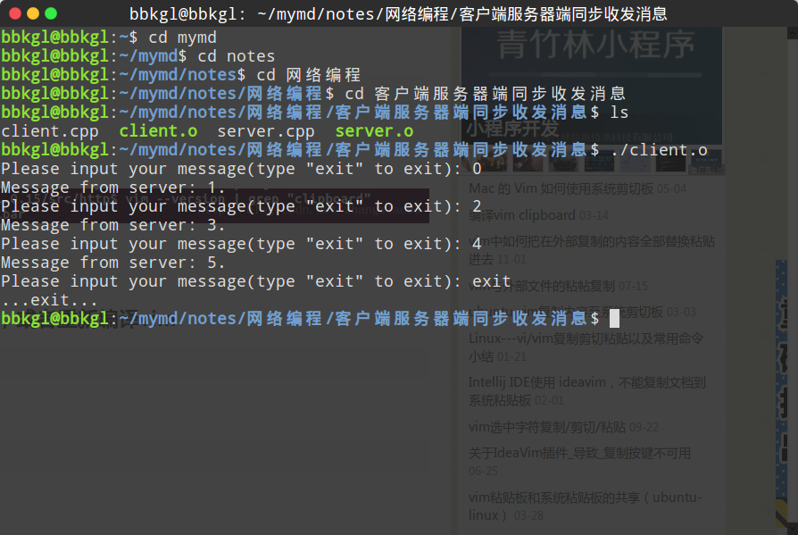
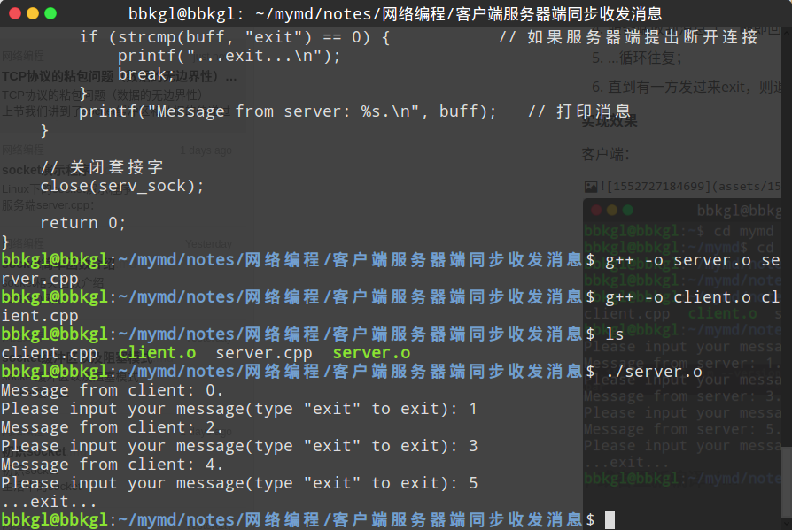

# TCP协议的粘包问题（数据的无边界性）

上节我们讲到了[socket缓冲区](socket缓冲区以及阻塞模式.md)和数据的传递过程，可以看到数据的接收和发送是无关的，read()/recv() 函数不管数据发送了多少次，都会尽可能多的接收数据。也就是说，read()/recv() 和 write()/send() 的执行次数可能不同。

例如，write()/send() 重复执行三次，每次都发送字符串"abc"，那么目标机器上的 read()/recv() 可能分三次接收，每次都接收"abc"；也可能分两次接收，第一次接收"abcab"，第二次接收"cabc"；也可能一次就接收到字符串"abcabcabc"。

假设我们希望客户端每次发送一位学生的学号，让服务器端返回该学生的姓名、住址、成绩等信息，这时候可能就会出现问题，服务器端不能区分学生的学号。例如第一次发送 1，第二次发送 3，服务器可能当成 13 来处理，返回的信息显然是错误的。

<font color = ff00>这就是数据的“粘包”问题，客户端发送的多个数据包被当做一个数据包接收。也称数据的无边界性，read()/recv() 函数不知道数据包的开始或结束标志（实际上也没有任何开始或结束标志），只把它们当做连续的数据流来处理</font>

下面的代码演示了沾包问题，客户端连续三次向服务器端发送数据，服务器端却一次性接收到所有数据。

服务器端代码：

```cpp
#include <cstdio>
#include <cstdlib>
#include <sys/socket.h>
#include <netinet/in.h>
#include <arpa/inet.h>
#include <unistd.h>
#include <cstring>

int main() {
    // 生成套接字
    int serv_sock = socket(AF_INET, SOCK_STREAM, 0);

    // 绑定套接字
    sockaddr_in serv_addr;
    bzero(&serv_addr, sizeof(serv_addr));
    serv_addr.sin_addr.s_addr = inet_addr("127.0.0.1");
    serv_addr.sin_port = htons(2333);
    serv_addr.sin_family = AF_INET;
    bind(serv_sock, (sockaddr *)&serv_addr, sizeof(sockaddr));

    // 进入监听状态
    listen(serv_sock, 20);

    // 接收客户端请求
    sockaddr_in clnt_addr;
    socklen_t clnt_addr_len = sizeof(clnt_addr);
    int clnt_sock = accept(serv_sock, (sockaddr *)&clnt_addr, &clnt_addr_len);

    // 沉睡5s
    sleep(5);

    // 接收客户端消息
    char buff[200];
    int recv_len = recv(clnt_sock, buff, sizeof(buff), 0);
    send(clnt_sock, buff, recv_len, 0);

    // 关闭套接字
    close(clnt_sock);
    close(serv_sock);

    return 0;
}
```

客户端代码：

```cpp
#include <cstdio>
#include <cstdlib>
#include <sys/socket.h>
#include <arpa/inet.h>
#include <cstring>
#include <unistd.h>

int main() {
    // 套接字
    int serv_sock = socket(AF_INET, SOCK_STREAM, IPPROTO_TCP);

    // 服务端参数设置
    sockaddr_in serv_addr;
    bzero(&serv_addr, sizeof(serv_addr));
    serv_addr.sin_family = AF_INET;
    serv_addr.sin_port = htons(2333);
    serv_addr.sin_addr.s_addr = inet_addr("127.0.0.1");

    // 连接服务端
    connect(serv_sock, (sockaddr *)&serv_addr, sizeof(sockaddr));

    // 发送消息
    const unsigned int size = 200;
    char buff[size] = "Hello!";
    for (int i = 0; i < 3; i++) {
        send(serv_sock, buff, strlen(buff), 0);  // 这里细节，strlen(函数)使得'\0'并没有被发送过去
    }
    strcpy(buff, "Error!");

    // 打印服务端回复的消息
    int recv_len = recv(serv_sock, buff, size, 0);
    printf("Message from server: %s\n", buff);

    close(serv_sock);

    return 0;
}
```

服务器端打印输出：

```cpp
From buffer: Hello!Hello!Hello!.
```

客户端打印输出：

```cpp
Message from server: Hello!Hello!Hello!
```

根据调试，描述为以下过程：

1. 客户端->“Hello!“->客户端输入缓冲区->服务端;
   - 服务器端输出缓冲区：”Hello!“
2. 客户端->“Hello!“->客户端输入缓冲区->服务端;
   - 服务器端输出缓冲区：”Hello!Hello!“
3. 客户端->“Hello!“->客户端输入缓冲区->服务端;
   - 服务器端输出缓冲区：”Hello!Hello!Hello!“
4. 经过5s以后，服务器端阻塞状态解除，客户端进入阻塞状态，等待服务器端回复消息到缓冲区；
5. 服务器端从缓冲区读取到“Hello!Hello!Hello!“，并原样返回给客户端；
6. 客户端收到消息，阻塞状态解除，并打印输出。

根据以上过程输出，我们可以得出如下结论：

1. 客户端发送分三次发送，但是服务端却将三次消息全都存在了缓冲区；
2. 服务器端从缓冲区取出数据时，会一次将缓冲区所有数据都取出；
3. 客户端在接收服务端回复的消息时，由于缓冲区中暂无服务端发送过来的消息，此时会被阻塞，直到服务端有数据过来。

注意问题：

- 无论服务器端还是客户端，在收到数据，从缓冲区中读取时，都可以控制读取长度，详见read()/recv()函数的第三个参数；
- 无论服务器端还是客户端，在发送数据到缓冲区中时，都可以控制读取长度，详见write()/send()函数的第三个参数；**本例中客户端代码第16行send()函数并没有将字符串的‘\0’压入到缓冲区！**
- linux中sleep(int time)函数的时间单位为秒，usleep()为微秒。

**关于阻塞模式的一点思考**

如果客户端要多次发送消息，并希望服务器端收到的消息也是一次一次收到的，需要让二者在动作上同步，这可能就是接下来要学到的同步异步问题（我的猜测）。。。

下面说一下自己实现服务器端和客户端通信，同步收发消息的思路：

1. 首先客户端和服务器端建立连接；
2. 服务端由于未收到消息进入阻塞状态；
3. 客户端开始发送消息”1“，并进入阻塞状态（等待消息）；
4. 服务端收到消息“1”，随即回复消息，并进入阻塞状态（等待消息）；
5. …循环往复；
6. 直到有一方发过来exit，则退出程序，断开连接。

**实现效果**

客户端：



服务器端：



具体实现请看源程序：[点我](客户端服务器端同步收发消息)

