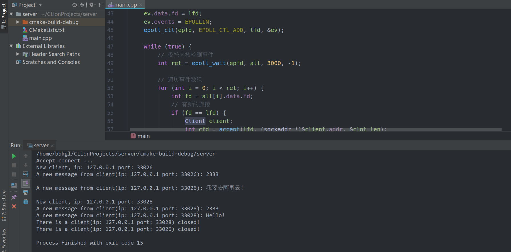

# epoll服务器实现

---

> 上一节有伪代码实现：[epoll介绍](epoll介绍)

在上一节伪代码实现的基础上，通过unordered_map使得一个文件描述符对应了一个client结构体。每次消息来的时候，都会通过ip和端口提示是哪个客户端发过来的。

效果如下图：



Client结构体：

```cpp
struct Client {
    int fd;
    sockaddr_in addr;
};
```

以文件描述符为键，Client结构体为值定义了unordered_map—client_map：

```cpp
// 客户端addr
std::unordered_map<int, Client> client_map;
socklen_t clnt_len = sizeof(sockaddr);
```

以**伪代码**的形式写一下思路：

```cpp
struct Client {
    int fd;
    sockaddr_in addr;
};

int main() {
    // 监听套接字文件描述符
    int lfd = socket();
    bind();
    listen();
    
    unordered_map<int, Client> client_map;
    
    // 初始化根结点
    int epfd = epoll_create(3000);
    // 传入记录时事件的数组
    epoll_event all[3000];
    
    // 初始化，将监听的文件描述符绑定到树上
    epoll_event ev;
    epoll_ctl(epfd, EPOLL_CTL_ADD, lfd, &ev);
    
    while (true) {
        // 委托内核进行监听
        int ret = epoll_wait(epfd, all, 3000, -1);
        
        for (int i = 0; i < ret; i++) {
            int fd = all[i].data.fd;
            // 新的连接
            if (fd == lfd) {
                Client client;
                int cfd = accept(lfd, (sockaddr *)&client.addr, &clnt_len);
                
                // 对于新的连接，将fd（键）和client（值）键值对加入到client_map
                client_map[cfd] = client;
                
                // 新的连接挂到树上
                ev.data.fd = fd;
                ev.events = EPOLLIN;
                epoll_ctl(epfd, EPOLL_CTL_ADD, fd, &ev);
                printf("打印新的客户端连接，附上客户端的ip和端口");
            }
            // 如果是已连接的客户端发送的通信消息
            else {
                // 如果不是客户端发送消息事件，就跳过
                if (!all[i].events & EPOLLIN) continue;
                
                int len = recv();
                if (len == -1) {
                    std::cerr << "Read error!\n";
                    exit(1);
                } else if (len == 0) {  // 如果是客户端关闭了连接
                    close(fd);
                    // 将要断开的连接从树上删除
                    epoll_ctl(epfd, EPOLL_CTL_DEL, fd, NULL);
                    // 打印客户端断开连接的消息，加上该客户端的ip和端口
                    printf("There is a client(ip: %s port: %d) closed!\n", inet_ntoa(client_map[fd].addr.sin_addr),ntohs(client_map[fd].addr.sin_port));
                    // 从map中删除
                    client_map.erase(fd);
                } else { // 如果是正常消息
                    // 打印消息，并表明是那个客户端（ip和端口）
                    printf("A new message from client(ip: %s port: %d): %s\n", inet_ntoa(client_map[fd].addr.sin_addr),ntohs(client_map[fd].addr.sin_port), buff);
                    write();   // 回复消息
                }
            }
        }
    }
    
    close(lfd);
    
    return 0;
}
```

[查看具体实现代码！](epoll服务器实现/epoll.cpp)