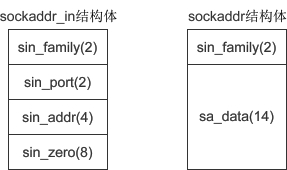

# socket相关函数介绍

---

## socket()函数

在linux下使用<sys/socket.h>头文件中socket()函数来创建套接字，原型为：

```cpp
int socket(int af, int type, int protocol);
```

1.  af 为地址族（Address Family），也就是 IP 地址类型，常用的有 AF_INET 和 AF_INET6。AF 是“Address Family”的简写，INET是“Inetnet”的简写。AF_INET 表示 IPv4 地址，例如 127.0.0.1；AF_INET6 表示 IPv6 地址，例如 1030::C9B4:FF12:48AA:1A2B。<font color = FF000>`127.0.0.1`，它是一个特殊IP地址，表示本机地址，后面的教程会经常用到。</font>
2.  type 为数据传输方式/套接字类型，常用的有 SOCK_STREAM（流格式套接字/面向连接的套接字） 和 SOCK_DGRAM（数据报套接字/无连接的套接字），已经在[初识socket](初识socket.md)一节中进行了介绍。
3.  protocol 表示传输协议，常用的有 IPPROTO_TCP 和 IPPTOTO_UDP，分别表示 TCP 传输协议和 UDP 传输协议。

**创建TCP套接字**

```cpp
int tcp_socket = socket(AF_INET, SOCK_STREAM, IPPROTO_TCP);  //IPPROTO_TCP表示TCP协议
```

**创建UDP套接字**

```cpp
int udp_socket = socket(AF_INET, SOCK_DGRAM, IPPROTO_UDP);  //IPPROTO_UDP表示UDP协议
```

**简化写法**

```cpp
int tcp_socket = socket(AF_INET, SOCK_STREAM, 0);  //创建TCP套接字
int udp_socket = socket(AF_INET, SOCK_DGRAM, 0);  //创建UDP套接字
```

## bind()函数

bind() 函数的原型为： 

```cpp
int bind(int sock, struct sockaddr *addr, socklen_t addrlen);  //Linux
int bind(SOCKET sock, const struct sockaddr *addr, int addrlen);  //Windows
```

sock 为 socket 文件描述符，addr 为 sockaddr 结构体变量的指针，addrlen 为 addr 变量的大小，可由 sizeof() 计算得出。

下面的代码，将创建的套接字与IP地址 127.0.0.1、端口 1234 绑定：

```cpp
//创建套接字
int serv_sock = socket(AF_INET, SOCK_STREAM, IPPROTO_TCP);

//创建sockaddr_in结构体变量
struct sockaddr_in serv_addr;
memset(&serv_addr, 0, sizeof(serv_addr));  //每个字节都用0填充
serv_addr.sin_family = AF_INET;  //使用IPv4地址
serv_addr.sin_addr.s_addr = inet_addr("127.0.0.1");  //具体的IP地址
serv_addr.sin_port = htons(1234);  //端口

//将套接字和IP、端口绑定
bind(serv_sock, (struct sockaddr*)&serv_addr, sizeof(serv_addr));
```

<font color = ff000>这里使用 sockaddr_in 结构体，然后再强制转换为 sockaddr 类型，为什么这样做，先立个flag！</font>

接下来不妨先看一下 sockaddr_in 结构体，它的成员变量如下：

```cpp
struct sockaddr_in{
    sa_family_t     sin_family;   //地址族（Address Family），也就是地址类型    
    uint16_t        sin_port;     //16位的端口号    
    struct in_addr  sin_addr;     //32位IP地址    char            
    sin_zero[8];  //不使用，一般用0填充
};
```

1. sin_family 和 socket() 的第一个参数的含义相同，取值也要保持一致；
2. sin_prot 为端口号。uint16_t 的长度为两个字节，理论上端口号的取值范围为 0~65536，但 0~1023 的端口一般由系统分配给特定的服务程序，例如 Web 服务的端口号为 80，FTP 服务的端口号为 21，所以我们的程序要尽量在 1024~65536 之间分配端口号。<font color = ff000>端口号需要用 htons() 函数转换，要将主机字节序转成网络字节序</font>；
3. sin_addr 是 struct in_addr 结构体类型的变量；
   - in_addr结构体只有一个成员变量s_ddr，用来存放32位的ip地址；
   - IP地址是一个字符串，所以需要 inet_addr() 函数进行转换。
4. sin_zero[8] 是多余的8个字节，没有用，一般使用 memset() 函数填充为 0。上面的代码中，先用 memset() 将结构体的全部字节填充为 0，再给前3个成员赋值，剩下的 sin_zero 自然就是 0 了。

<font color = ff000>**为什么使用 sockaddr_in 而不使用 sockaddr？**</font>

bind() 第二个参数的类型为 sockaddr，而代码中却使用 sockaddr_in，然后再强制转换为 sockaddr，这是为什么呢？

sockaddr 结构体的定义如下：

```cpp
struct sockaddr{
    sa_family_t  sin_family;   //地址族（Address Family），也就是地址类型
    char         sa_data[14];  //IP地址和端口号
};
```

下图是 sockaddr 与 sockaddr_in 的对比（括号中的数字表示所占用的字节数）：



sockaddr 和 sockaddr_in 的长度相同，都是16字节，只是将IP地址和端口号合并到一起，用一个成员 sa_data 表示。要想给 sa_data 赋值，必须同时指明IP地址和端口号，例如”127.0.0.1:80“，遗憾的是，没有相关函数将这个字符串转换成需要的形式，也就很难给 sockaddr 类型的变量赋值，所以使用 sockaddr_in 来代替。这两个结构体的长度相同，强制转换类型时不会丢失字节，也没有多余的字节。

<font color = ff000>可以认为，sockaddr 是一种通用的结构体，可以用来保存多种类型的IP地址和端口号，而sockaddr_in 是专门用来保存 IPv4 地址的结构体。</font>

另外还有 sockaddr_in6，用来保存 IPv6 地址，它的定义如下：

```cpp
struct sockaddr_in6 { 
    sa_family_t sin6_family;  //(2)地址类型，取值为AF_INET6
    in_port_t sin6_port;  //(2)16位端口号
    uint32_t sin6_flowinfo;  //(4)IPv6流信息
    struct in6_addr sin6_addr;  //(4)具体的IPv6地址
    uint32_t sin6_scope_id;  //(4)接口范围ID
};
```

<font color = ff000>正是由于通用结构体 sockaddr 使用不便，才针对不同的地址类型定义了不同的结构体。</font>

##  connect() 函数

 connect() 函数用来建立连接，它的原型为： 

```cpp
int connect(int sock, struct sockaddr *serv_addr, socklen_t addrlen);  //Linux
int connect(SOCKET sock, const struct sockaddr *serv_addr, int addrlen);  //Windows
```

对于服务器端程序，使用 bind() 绑定套接字后，还需要使用 listen() 函数让套接字进入被动监听状态，再调用 accept() 函数，就可以随时响应客户端的请求了。

## listen() 函数

通过 listen() 函数可以让套接字进入被动监听状态，它的原型为： 

```cpp
int listen(int sock, int backlog);  //Linux
int listen(SOCKET sock, int backlog);  //Windows
```

 sock 为需要进入监听状态的套接字，backlog 为请求队列的最大长度。

所谓被动监听，是指当没有客户端请求时，套接字处于“睡眠”状态，只有当接收到客户端请求时，套接字才会被“唤醒”来响应请求。

**请求队列**

当套接字正在处理客户端请求时，如果有新的请求进来，套接字是没法处理的，只能把它放进缓冲区，待当前请求处理完毕后，再从缓冲区中读取出来处理。如果不断有新的请求进来，它们就按照先后顺序在缓冲区中排队，直到缓冲区满。这个缓冲区，就称为请求队列（Request Queue）。

缓冲区的长度（能存放多少个客户端请求）可以通过 listen() 函数的 backlog 参数指定，但究竟为多少并没有什么标准，可以根据你的需求来定，并发量小的话可以是10或者20。

如果将 backlog 的值设置为 SOMAXCONN，就由系统来决定请求队列长度，这个值一般比较大，可能是几百，或者更多。

当请求队列满时，就不再接收新的请求，对于 Linux，客户端会收到 ECONNREFUSED 错误，对于 Windows，客户端会收到 WSAECONNREFUSED 错误。

注意：listen() 只是让套接字处于监听状态，并没有接收请求。接收请求需要使用 accept() 函数。

##  accept() 函数

 当套接字处于监听状态时，可以通过 accept() 函数来接收客户端请求。它的原型为： 

```cpp
纯文本复制
int accept(int sock, struct sockaddr *addr, socklen_t *addrlen);  //Linux
SOCKET accept(SOCKET sock, struct sockaddr *addr, int *addrlen);  //Windows
```

它的参数与 listen() 和 connect() 是相同的：sock 为服务器端套接字，addr 为 sockaddr_in 结构体变量，addrlen 为参数 addr 的长度，可由 sizeof() 求得。

<font color = ff000>accept() 返回一个新的套接字来和客户端通信，addr 保存了客户端的IP地址和端口号，而 sock 是服务器端的套接字，大家注意区分。后面和客户端通信时，要使用这个新生成的套接字，而不是原来服务器端的套接字。</font>

最后需要说明的是：listen() 只是让套接字进入监听状态，并没有真正接收客户端请求，listen() 后面的代码会继续执行，直到遇到 accept()。accept() 会阻塞程序执行（后面代码不能被执行），直到有新的请求到来。

##  Linux下数据的接收和发送

 Linux 不区分套接字文件和普通文件，使用 write() 可以向套接字中写入数据，使用 read() 可以从套接字中读取数据。

前面我们说过，两台计算机之间的通信相当于两个套接字之间的通信，在服务器端用 write() 向套接字写入数据，客户端就能收到，然后再使用 read() 从套接字中读取出来，就完成了一次通信。

 write() 的原型为： 

```cpp
ssize_t write(int fd, const void *buf, size_t nbytes);
```

 fd 为要写入的文件的描述符，buf 为要写入的数据的缓冲区地址，nbytes 为要写入的数据的字节数。 

> size_t 是通过 typedef 声明的 unsigned int 类型；ssize_t 在 "size_t" 前面加了一个"s"，代表 signed，即 ssize_t 是通过 typedef 声明的 signed int 类型。

 write() 函数会将缓冲区 buf 中的 nbytes 个字节写入文件 fd，成功则返回写入的字节数，失败则返回 -1。

 read() 的原型为： 

```cpp
ssize_t read(int fd, void *buf, size_t nbytes);
```

 fd 为要读取的文件的描述符，buf 为要接收数据的缓冲区地址，nbytes 为要读取的数据的字节数。

 read() 函数会从 fd 文件中读取 nbytes 个字节并保存到缓冲区 buf，成功则返回读取到的字节数（但遇到文件结尾则返回0），失败则返回 -1。 

##  Windows下数据的接收和发送

 Windows 和 Linux 不同，Windows 区分普通文件和套接字，并定义了专门的接收和发送的函数。

 从服务器端发送数据使用 send() 函数，它的原型为： 

```cpp
int send(SOCKET sock, const char *buf, int len, int flags);
```

sock 为要发送数据的套接字，buf 为要发送的数据的缓冲区地址，len 为要发送的数据的字节数，flags 为发送数据时的选项。

 返回值和前三个参数不再赘述，最后的 flags 参数一般设置为 0 或 NULL，初学者不必深究。

 在客户端接收数据使用 recv() 函数，它的原型为： 

```cpp
int recv(SOCKET sock, char *buf, int len, int flags);
```

