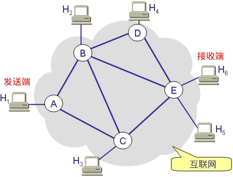
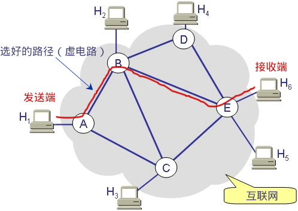
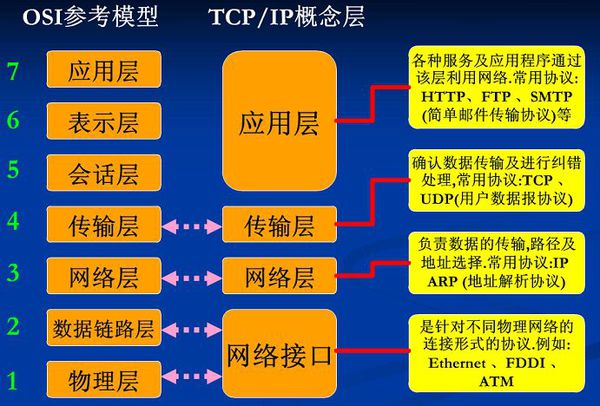
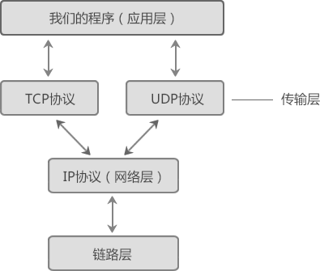
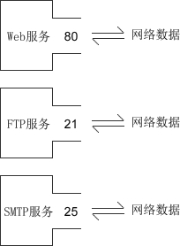

# 计网基本知识

---

上图是一个简化的互联网模型，H1~H6表示计算机，A-E表示路由器，发送端发送的数据必须经由路由器的转发才能到达接收端。

假设H1要发送若干个数据包给H6，那么有多条路径可以选择，比如：

-  路径①：H1 --> A --> C --> E --> H6
-  路径②：H1 --> A --> B --> E --> H6
-  路径③：H1 --> A --> B --> D --> E --> H6
-  路径④：H1 --> A --> B --> C --> E --> H6
-  路径⑤：H1 --> A --> C --> B --> D --> E --> H6

> 数据包的传输路径是路由器根据算法来计算出来的，算法会考虑很多因素，比如网络的拥堵状况，下一个路由器是否忙碌等。

## 目录

|           chapter1            |        chapter2         |        chapter3         |  chapter4   |
| :---------------------------: | :---------------------: | :---------------------: | :---------: |
|[面向连接和无连接](#T&U)|[OSI网络七层模型](#OSI)|[TCP/IP协议族](#tcp/ip)|[IP、MAC、端口号](#ip)|

---

## 面向连接和无连接到底有什么区别？

### 无连接的套接字

对于无连接的套接字，每个数据包可以选择不同的路径，比如第一个数据包选择路径④，第二个数据包选择路径①，第三个数据包选择路径②……当然，它们也可以选择相同的路径，那也只不过是巧合而已。

每个数据包之间都是独立的，各走各的路，谁也不影响谁，除了迷路的或者发生意外的数据包，最后都能到达 H6。但是，到达的顺序是不确定的，比如： 

-  第一个数据包选择了一条比较长的路径（比如路径⑤），第三个数据包选择了一条比较短的路径（比如路径①），虽然第一个数据包很早就出发了，但是走的路比较远，最终还是晚于第三个数据包达到。
-  第一个数据包选择了一条比较短的路径（比如路径①），第三个数据包选择了一条比较长的路径（比如路径⑤），按理说第一个数据包应该先到达，但是非常不幸，第一个数据包走的路比较拥堵，这条路上的数据量非常大，路由器处理得很慢，所以它还是晚于第三个数据包达到了。

还有一些意外情况会发生，比如： 

-  第一个数据包选择了路径①，但是路由器C突然断电了，那它就到不了 H6 了。
-  第三个数据包选择了路径②，虽然路不远，但是太拥堵，以至于它等待的时间太长，路由器把它丢弃了。

 总之，对于无连接的套接字，数据包在传输过程中会发生各种不测，也会发生各种奇迹。H1 只负责把数据包发出，至于它什么时候到达，先到达还是后到达，有没有成功到达，H1 都不管了；H6 也没有选择的权利，只能被动接收，收到什么算什么，爱用不用。

 无连接套接字遵循的是「尽最大努力交付」的原则，就是尽力而为，实在做不到了也没办法。无连接套接字提供的没有质量保证的服务。 

### 面向连接的套接字

面向连接的套接字在正式通信之前要先确定一条路径，没有特殊情况的话，以后就固定地使用这条路径来传递数据包了。当然，路径被破坏的话，比如某个路由器断电了，那么会重新建立路径。

这条路径是由路由器维护的，路径上的所有路由器都要存储该路径的信息（实际上只需要存储上游和下游的两个路由器的位置就行），所以路由器是有开销的。

 H1 和 H6 通信完毕后，要断开连接，销毁路径，这个时候路由器也会把之前存储的路径信息擦除。

 在很多网络通信教程中，这条预先建立好的路径被称为“虚电路”，就是一条虚拟的通信电路。

 为了保证数据包准确、顺序地到达，发送端在发送数据包以后，必须得到接收端的确认才发送下一个数据包；如果数据包发出去了，一段时间以后仍然没有得到接收端的回应，那么发送端会重新再发送一次，直到得到接收端的回应。这样一来，发送端发送的所有数据包都能到达接收端，并且是按照顺序到达的。 

> 发送端发送一个数据包，如何得到接收端的确认呢？很简单，为每一个数据包分配一个 ID，接收端接收到数据包以后，再给发送端返回一个数据包，告诉发送端我接收到了 ID 为 xxx 的数据包。

面向连接的套接字会比无连接的套接字多出很多数据包，因为发送端每发送一个数据包，接收端就会返回一个数据包。此外，建立连接和断开连接的过程也会传递很多数据包。
不但是数量多了，每个数据包也变大了：除了源端口和目的端口，面向连接的套接字还包括序号、确认信号、数据偏移、控制标志（通常说的 URG、ACK、PSH、RST、SYN、FIN）、窗口、校验和、紧急指针、选项等信息；而无连接的套接字则只包含长度和校验和信息。
有连接的数据包比无连接大很多，这意味着更大的负载和更大的带宽。许多即时聊天软件采用 UDP 协议（无连接套接字），与此有莫大的关系。

### 总结

两种套接字各有优缺点： 

-  无连接套接字传输效率高，但是不可靠，有丢失数据包、捣乱数据的风险；
-  有连接套接字非常可靠，万无一失，但是传输效率低，耗费资源多。

## OSI网络七层模型

OSI模型把网络通信的工作分为7层，从下到上分别是物理层、数据链路层、网络层、传输层个、会话层、表示层、应用层。

OSI 只是存在于概念和理论上的一种模型，它的缺点是分层太多，增加了网络工作的复杂性，所以没有大规模应用。后来人们对 OSI 进行了简化，合并了一些层，最终只保留了 4 层，从下到上分别是接口层、网络层、传输层、应用层，这就是大名鼎鼎的   **TCP/IP 模型**   。

### TCP/IP 模型如何工作？

简而言之就是数据的封装。

1. 发送

    - 平时使用的程序或者软件一般都是通过应用层来访问网络的；
    - 程序产生的数据会一层一层往下传输，直到最后的网络接口层；
    - 每往下走一层，就会被这一层的协议加上一层包装；
    - 然后通过网络发送到互联网上。
2. 接收
    - 从网络接口层再一层一层往上传输；
    - 每传输一层就拆开一层包装；
    - 直到最后应用层，就得到了最开始发送的数据。

而socket编程，就是在传输层的基础上，所以可以使用TCP/UDP协议，但是不能访问网页，因为访问网页的http协议位于应用层。

两台计算机进行通信时，必须遵守以下原则：

- 必须是同一层次进行通信，比如，A 计算机的应用层和 B 计算机的传输层就不能通信，因为它们不在一个层次，数据的拆包会遇到问题；
- 每一层的功能都必须相同，也就是拥有完全相同的网络模型。如果网络模型都不同，那不就乱套了，谁都不认识谁；
- 数据只能逐层传输，不能跃层；
- 每一层可以使用下层提供的服务，并向上层提供服务。

## TCP/IP协议族

> 协议仅仅是一种规范，必须由计算机软件来实现。例如IP协议规定了如何找到目标计算机，那么各开发商在开发软件时就必须遵守该协议，不能另起炉灶。

TCP/IP 模型包含了 TCP、IP、UDP、Telnet、FTP、SMTP 等上百个互为关联的协议，其中 TCP 和 IP 是最常用的两种底层协议，所以把它们统称为“TCP/IP 协议族”。

socket编程是基于TCP和UDP协议的，它们的层级关系如下：

## IP、MAC、端口号

### IP地址

IP地址是 Internet Protocol Address 的缩写，译为“网际协议地址”。

目前大部分软件使用 IPv4 地址，但 IPv6 也正在被人们接受，尤其是在教育网中，已经大量使用。

一台计算机可以拥有一个独立的 IP 地址，一个局域网也可以拥有一个独立的 IP 地址（对外就好像只有一台计算机）。对于目前广泛使用 IPv4 地址，它的资源是非常有限的，一台计算机一个 IP 地址是不现实的，往往是一个局域网才拥有一个 IP 地址。

在因特网上进行通信时，必须要知道对方的 IP 地址。实际上数据包中已经附带了 IP 地址，把数据包发送给路由器以后，路由器会根据 IP 地址找到对方的地理位置，完成一次数据的传递。路由器有非常高效和智能的算法，很快就会找到目标计算机。

### MAC地址

现实的情况是，一个局域网往往才能拥有一个独立的 IP；换句话说，IP 地址只能定位到一个局域网，无法定位到具体的一台计算机。

其实，真正能唯一标识一台计算机的是 MAC 地址，每个网卡的 MAC 地址在全世界都是独一无二的。计算机出厂时，MAC 地址已经被写死到网卡里面了（当然通过某些“奇巧淫技”也是可以修改的）。局域网中的路由器/交换机会记录每台计算机的 MAC 地址。

> MAC 地址是 Media Access Control Address 的缩写，直译为“媒体访问控制地址”，也称为局域网地址（LAN Address），以太网地址（Ethernet Address）或物理地址（Physical Address）。

数据包中除了会附带对方的 IP 地址，还会附带对方的 MAC 地址，当数据包达到局域网以后，路由器/交换机会根据数据包中的 MAC 地址找到对应的计算机，然后把数据包转交给它，这样就完成了数据的传递。

### 端口号

有了 IP 地址和 MAC 地址，虽然可以找到目标计算机，但仍然不能进行通信。一台计算机可以同时提供多种网络服务，例如 Web 服务（网站）、FTP 服务（文件传输服务）、SMTP 服务（邮箱服务）等，仅有 IP 地址和 MAC 
地址，计算机虽然可以正确接收到数据包，但是却不知道要将数据包交给哪个网络程序来处理，所以通信失败。
为了区分不同的网络程序，计算机会为每个网络程序分配一个独一无二的端口号（Port Number），例如，Web 服务的端口号是 80，FTP 服务的端口号是 21，SMTP 服务的端口号是 25。
端口（Port）是一个虚拟的、逻辑上的概念。可以将端口理解为一道门，数据通过这道门流入流出，每道门有不同的编号，就是端口号。如下图所示：

