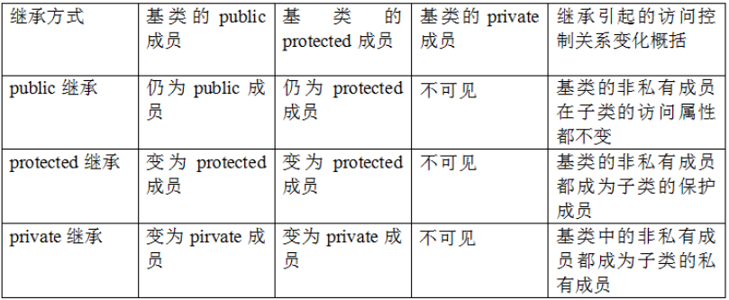
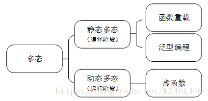
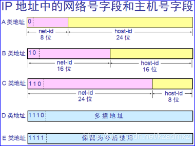
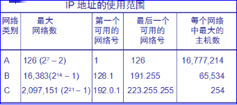

# [趋势科技+广联达-后台开发-面经](https://www.nowcoder.com/discuss/183215 )

> **打不倒你的终究会使你变强大！！** 

## 趋势科技一面

### 1.简单自我介绍

### 2.多线程

是指从软件或者硬件上实现多个线程并发执行的技术。 具有多线程能力的计算机因有硬件支持而能够在同一时间执行多于一个线程，进而提升整体处理性能。 

### 3.多进程

在操作系统中，一个时间段中有多个进程都处于已启动运行到运行完毕之间的状态。 

### 4.多线程编程需要注意什么问题？

线程安全问题，以及线程的调度和阻塞。

### 5.如何解决线程安全问题？

加锁。

### 6.讲一下锁？

线程之间的锁有：互斥锁、条件锁、自旋锁、读写锁、递归锁。一般而言，锁的功能越强大，性能就会越低。 

1. 互斥锁

   互斥锁就是用于控制多个线程对于他们共享资源的访问，也就是为了避免多个线程同时访问某个资源而导致混乱。任何一个线程都要使用互斥锁互斥访问共享资源（任务队列），访问完后要释放互斥锁。

2. 条件锁

   条件锁就是条件变量。也就是一个线程在符合某种条件时，程序会使用条件变量使得该线程处于阻塞状态。一旦条件允许了，就会唤醒该线程继续执行。比较常见的就是用在线程池中，如果任务队列中暂时没有任务，那么这个线程就会被条件变量设置成阻塞状态。

3. 自旋锁

   自旋锁的作用应该是相对互斥锁而言的。使用互斥锁时，如果线程2访问共享资源发现锁已经被线程1占用，就会被阻塞，执行线程2的CPU就会把线程2放入等待队列，去执行其他任务。而使用自旋锁时，线程2不会被阻塞，会持续地申请自旋锁，这样会一直占用CPU资源。**注意：自旋锁适合于短时间的的轻量级的加锁机制。 **

4. 读写锁

   一次只有一个线程可以占有写模式的读写锁, 但是可以有多个线程同时占有读模式的读写锁。

5. 递归锁

### 7.加锁会出现什么问题？

会出现死锁的问题。

### 8.介绍一下死锁，定义和发生条件？

1. 定义

   死锁是两个或两个以上的线程在执行过程中，由于资源竞争造成的一种阻塞现象。若无外力作用，那死锁状态就会持续下去。

2. 发生条件

   1. 互斥条件

      指线程对某个共享资源访问时，其他线程就不能访问该资源。

   2. 请求和保持条件

      指线程在持有某个资源时，请求访问被占用资源而阻塞时，不会释放自己占用的资源。

   3. 不剥夺条件

      任何资源在被某个线程占用时，其他线程不能剥夺和占用该资源。

   4. 循环等待条件

      发生死锁时，各个线程形成一个资源环路，造成永久阻塞。

3. 如何避免或者解决

   死锁检测、设置超时等。
   
### 9.进程间通信方式

1. 无名管道

   - 父子或兄弟进程之间通信
   - 只存在于内存中
   - 半双工

2. 有名管道

   - 非亲缘关系进程也可以进行通信
   - 以文件形式存在于文件系统中

3. 共享内存

   给多个进程一块共享的存储区域，通常使用信号量来同步对共享内存的访问。

4. 信号量

   用于进程同步，如果要在进程间实现通信需要结合共享内存。

5. 消息队列

   消息队列，是消息的链接表，存放在内核中。 

   - 消息队列是面向记录的，有特定的格式和优先级
   - 独立于发送和接收进程
   - 消息队列可以实现随机查询，不一定要按先进先出的规则读取

### 10. C中数组越界怎么解决？。。。我觉得应该是怎么避免？ 

- 进行越界检查
- 显示地指定数组的边界

### 11.继承有几种方式？

三种，公有、私有、保护。

1. 基类私有成员在派生类中都不可见

2. 继承不能向上提高成员的访问权限，即父类中的protected成员无论通过什么继承方式都不能变成public的
3. 在2的基础上，基类的public和protected成员的访问权限跟随继承方式而变

详细如下表：

 

### 12.两种多态讲一下？

 

### 13.数据库了解吗？

我不了解。。。。2333

### 14.IP地址划分

 

 

### 15. 子网的掩码的作用

子网掩码只有一个作用，就是将某个IP地址划分成[网络地址](https://baike.baidu.com/item/%E7%BD%91%E7%BB%9C%E5%9C%B0%E5%9D%80/9765459)和[主机地址](https://baike.baidu.com/item/%E4%B8%BB%E6%9C%BA%E5%9C%B0%E5%9D%80/9765500)两部分。

### 16.你了解STL的哪些容器？

只是用过一些，没有去看过源码，常用的vector，map，set，list等。

### 17.说一下Hash

1. Hash函数

   哈希就是把任意长度的输入通过哈希算法或者是函数转换成固定长度的输出，也就是散列值。 常用的哈希函数有直接寻址法，平方取中法，数字分析法等。

2. Hash冲突处理

   哈希函数同时一般伴随着哈希冲突，通常处理哈希冲突的方法有开放寻址法，再散列法等。

   开放寻址法（Hi = (H(key) + di) % m）,其中H()为散列函数，di为增量序列，m为表长：

   - 线性探测法，di = 1,2,3,4...
   - 二次方探测法，di = 1,2^2,3^2,4^2...

3. Hash Table 

   哈希表是一种数据结构，将key值通过Hash函数得到一个散列值，该散列值就是key对应的value在数据表数组中的下标或者地址。

## 趋势科技二面

### 1.项目讲讲吧 

我这个是仿照陈硕muduo库实现的一个C++网络库，基于Reactor模式，IO模型是用的非阻塞IO+IO多路复用。

主要用到的技术点有：

- epoll水平触发的IO多路复用技术
- 非阻塞IO，水平触发的话，主要效率提升是提现在发送数据上
- 使用eventfd实现线程的异步缓醒
- 基于(STL set)实现的定时器管理队列
- 禁用Nagle算法，降低延迟
- 实现线程池，避免线程的频繁创建销毁浪费资源
- 主线程只负责接收连接，然后通过Round-robin的方式分发给子线程处理
- 支持shutdown优雅关闭连接
- 使用智能指针来进行对象生命期的管理，减少内存泄露的可能

### 2.项目中遇到过什么问题，代码方面的？

遇到过一次智能指针shared_ptr引用计数变成0，导致对象提前析构的问题。我用了一个map中的一个智能指针指向了一个连接对象，同时一个函数中的临时智能指针也指向了这个连接对象，因为执行的是断开连接的操作，也就是要把这个连接对象从map中删除，所以在删除并执行完这个函数后，引用计数为0，这个连接对象被析构了，但是后面还有一些操作没执行完，所以出错了。后面是通过将这个函数拆成了两个函数，把从map中删除这个操作放在另一个函数中，然后把这个函数注册回调到一个执行队列中，最后把一系列断开连接的操作执行完以后，再去执行队列里，删除这个智能指针，执行队列是在最后执行的。

### 3. 有没有内存泄漏 ？

这个倒没有碰到，一开始基本都用的普通指针，后面大部分换成了智能指针，shared_ptr和unique_ptr。

### 4.怎么处理内存泄露的问题？

- 能用智能指针的地方用只能指针
- 普通指针的话，new和delete一定要配对使用
- 基类的析构函数要定义成虚函数

### 5.怎么阻止你的程序多开？

创建一个互斥体，检查它是否已经被拥有了，如果有，说明互斥体已经建立（程序已经启动），否则表明程序未启动。

### 6.vector底层工作原理

vector就是动态数组，在堆中分配内存，是一块连续的空间。vector增加空间时，是重新申请一块相较原来两倍大的空间，然后将内容拷贝过来。

### 7. 怎么从控制台读入多行？ 

可以用：

```cpp
// getline()
while(getline(cin, s)) {};

// cin.getline()
while(cin.getline(s)) {};
```
### 8.成员函数存在一个隐藏变量，是啥，怎么工作的？

隐藏变量应该是this指针。this指针指向了对象内存的起始值，然后通过一个偏移量就能得到对象的各种成员。

### 9.常量函数成员为什么无法调用非常量数据成员函数？ 

从两个角度来答：

1. 常量成员函数中是不能改变对象的任何数据成员的，而在其中调用非常量成员函数就无法保证这个点；

2. 常量成员函数的this指针时是const类型的，无法传给非常量成员函数中的非const类型的形参，举例如下：

   ```cpp
   class A {
       void B (A *this) {}
       void C (const A * this) const {
           B(this);  // 报错，C中this指针为const，而B中不是
       }
   }
   ```

### 10.有序链表查找某个元素 。

1. 顺序查找O(N)；
2. 建立跳跃表查找O(logN)。

### 11.一个树要么没有节点，要么只有俩节点 

1. 哈夫曼树
2. 满二叉树

### 12.哈夫曼树

哈夫曼树又叫最优二叉树，也就是这棵树的带权路径和最小，就是哈夫曼树。

特点就是权值较大的结点离根结点更近。

如何创建一棵哈夫曼树：

1. 将所有结点建立最小堆；
2. 依次取出堆中最小的结点，两个结点之和组成一个新的父节点，并构成一棵树；
3. 将这个树根结点放入堆中，调整堆；
4. 继续过程2，直到最小堆中只有一个结点；
5. 以这个结点构成的树就是哈夫曼树。

### 13.一个矩阵有很多0，这个矩阵有什么用？

稀疏矩阵的应用。。。。

1. 三元组：只储存非0元素，存储每个非0元素的行列下标，每个非0元素就是一个三元组。。。
2. 十字链表：有点复杂，不看了。

### 14.想要阻止继承怎么办 ？

1. final关键字`class A final {}`
2. 使用private修饰构造函数，然后使用友元作为构造函数去调用构造函数

### 16.Overload(重载)和Override(重写)说一下？

1. Overload：

   - 重载是实现一个类的多个同名成员函数，要求这些函数之间形参列表不一样，或者有无const；

   - 静态多态的实现方式之一，另一个是泛型编程；
   - 重载指的是同一个类的同名函数之间的实现；
   - 重载要求形参列表不一样；

2. Override

   - 重写是子类重写父类的虚函数，从而实现动态多态；
   - 动态多态的实现方式；
   - 子类和父类的同名函数之间的实现；
   - 重写要求返回值、const、函数名、形参列表都要一样；

### 18. linux用过什么sdk？ 

没有。

### 19.网络编程server和client怎么写？ 

只会TCP的。

1. Sever：

   - 接受连接：socket() -> bzero() -> bind() -> listen -> epoll_create() -> epoll_ctl(add) -> while () {} -> epoll_wait() -> accept() -> epoll_ctl(add) ;
   - 处理读写：... -> epoll_wait() -> read/write()；
2. Client：
   - socket() -> connect() -> read/write();

### 20.如果有多个client访问，你怎么设计？ 

1. IO多路复用+非阻塞IO
2. 多线程
3. 多进程

### 21.多线程和多进程你趋向于用哪一个？

多线程，因为线程更加轻量，可以实现同样的功能，每个进程会独占资源。

### 22.大多数网络服务器设计都用啥？

1. nginx用多进程，在linux2.6以后也用了epoll的IO多路复用，与客户端通信默认边沿触发；
2. apache用多进程+select；
3. tomcat使用多线程；

