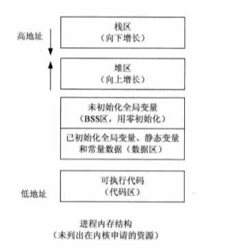

# [美团实习面经 ](https://www.nowcoder.com/discuss/189770)

## 一面

### 1.算法题：循环数组，给定一个key，返回在数组中的索引，找不到返回-1

？？？

### 2.C++对象内存布局

参考：[图说C++对象模型：对象内存布局详解](https://blog.csdn.net/smile_zhangw/article/details/79341141)

#### 非继承下的C++对象模型

- 静态成员变量在对象之外，普通成员变量在对象内；
- 静态函数和非静态函数以及虚函数全部都不在对象内；

- 对象内依次为指向type_info（用于支持运行时类型识别）的指针、指向虚函数表的指针、以及成员变量；

#### 单继承下

在之前非继承的基础上

- 若子类重写了父类的同名虚函数，则虚函数表中的父类虚函数被覆盖；
- 若子类定义了新的虚函数，则追加到虚函数表的后面；
- 子类继承父类，则子类和父类都会生成一张虚函数表；
- 在对象内存中，子类的成员变量会追加到之前父类的成员变量以后；

#### 普通多继承

- 会存在多个虚函数表，对象内存中由多个虚函数指针
- 子类的虚函数被放在声明的第一个基类的虚函数表中；
- 重写时，所有父类的同名虚函数都会被覆盖；
- 内存布局中，不同父类的成员变量按照父类的声明顺序排列，即第一个父类的成员变量会在第二个父类的虚函数表指针之前；

#### 菱形继承

因为两个父类继承了同一个爷爷类，则子类中可能出现多个爷爷类的成员变量

#### 虚继承

其内存布局与普通继承的区别体现在：

- 虚继承的子类，如果重新定义了虚函数，不会直接追加在父类虚函数的后面，会重新生成一张表和对象的虚函数指针，该指针在对象的最前面；
- 虚继承的子类也是也单独保留了父类的虚指针和虚表，这部分内容与子类的内容以一个四个字节的0来分隔；
- 虚继承的子类对象中，含有四字节的指针偏移。

### 3.类在操作系统中是怎么实现的？

？？？

### 4.为什么会有粘包？

数据的无边界性，即发送端发送的多个数据包被当成一个数据包来接收。因为数据的发送和接收是无关的，接收数据时会尽可能多地接收数据，这样就不可避免地一次性接收多次的数据。

主要是两点：

- 为了充分利用网络资源，发送端需要将小包组合成大包才发送数据（Nagle算法）
- 接收端没有及时地读取数据，造成粘包

Tips：UDP存在消息边界，所以没有粘包问题。

### 5.粘包处理的方式

- 每次发送的数据的长度是固定的
- 把消息尺寸和消息一起发送
- 使用特殊标记来区分消息间隔
- 禁用Nagle算法

### 6.http粘包怎么处理的？

http1.0的话是不用处理粘包的，因为一次性发送完就直接断开了。http1.1利用content-length等字段，来决定解析包的策略。

### 7.http2做了哪些改进？

- 提升了web性能
- 在与http1.x语义兼容的情况下，降低网络延迟
- 其他的太多了不想看了。。。

### 8.quic和udp有什么区别？

？？？

### 9.quic有哪些优势？

？？？

### 10.TCP拥塞避免

让拥塞窗口缓慢地增大，即每经过一个RTT的时间就把发送方的拥塞窗口+1，按线性规律增长。只要出现了拥塞避免，就让窗口大小变成当前的一半，再执行慢开始算法。

### 11.TCP的缺陷

- 流量控制算法不能很好地适应高带宽高延迟的场景
- 拥塞控制算法也不能很好地适应网络不太稳定的场景
- 粘包问题

### 12.Linux内存模型

栈、堆、未初始化全局变量或静态变量（BSS）、已初始化全局变量和静态变量以及常量（data）、代码段

